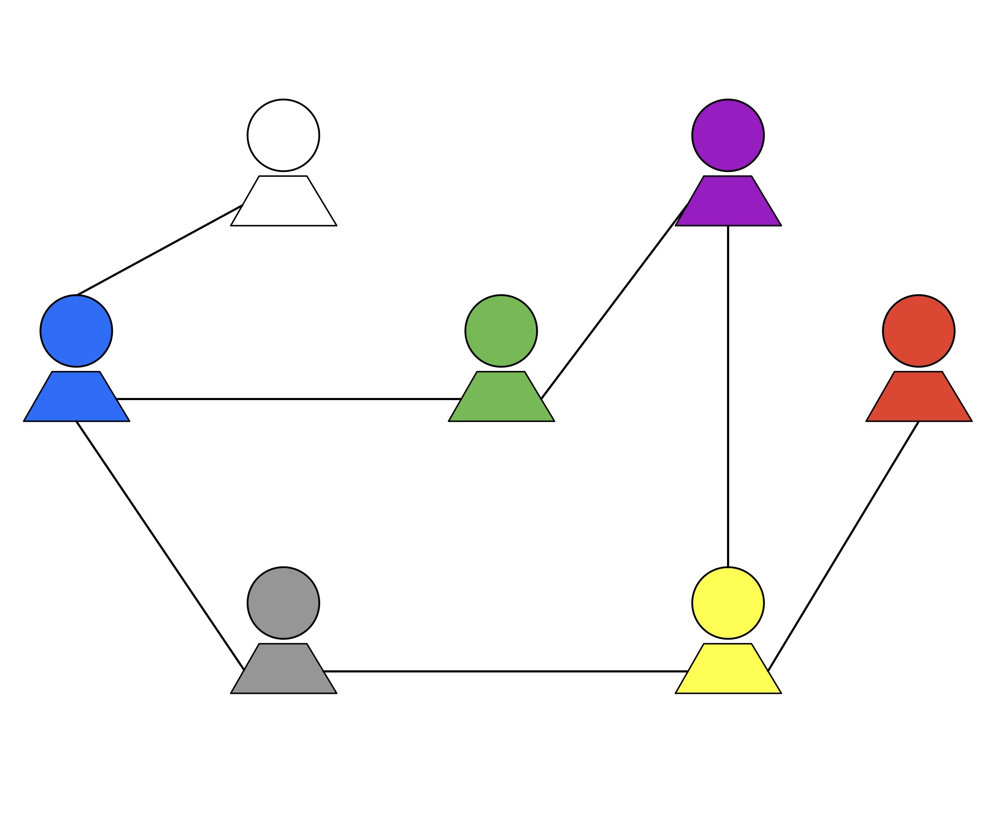

# Mutual Friends using MapReduce

This project can be found in [Educative.io](https://www.educative.io/)'s [JavaScript in Detail: From Beginner to Advanced](https://www.educative.io/courses/javascript-in-detail-from-beginner-to-advanced) course.


## Problem Description
Find mutual friends using MapReduce by simulating through JavaScript.


## Topics Covered
- [Background](#background)
- [Task](#task)
  - [Sub-tasks](#sub-tasks)
      1. [Setting up](#1-setting-up)
      2. [Map](#2-map)
      3. [Group](#3-group)
      4. [Reduce](#4-reduce)


## Background
A company wants to create a social media application called ***"FriendMe"***. This app will promote socializing between employees across offices. The application is almost complete but they need a feature that finds mutual friends between users. This feature can make users more comfortable with the app. Given that they have distributed servers across the globe, the **CTO** wants to use the **MapReduce framework** to implement this feature, distributing the computation overhead. The **CTO** wants ***you*** to simulate this feature in **JavaScript**.


## Task
Your task in this project is to use your **JavaScript** knowledge to help implement the simulation of the **MapReduce framework**. Then, the **CTO** will know if it is possible to create a **MapReduce** implementation for the company’s servers.  
  

  
The above illustration shows how users are connected to one another. Take a look at the steps required to find mutual friends while simulating the **MapReduce framework**.


### Sub-tasks
The **sub-tasks** of the project are here.


#### 1. Setting up
Take raw data in the form of an array and convert that into a JavaScript Object. This will give us a cleaner way of interfacing the user and their corresponding friends. The following is an example of the eventual interface.

```javascript
var friends = {
  A : [B, C, D],
  B : [A, D],
  C : [A],
  D : [A, B]
}
```

Here, each alphabet represents a user where, for the following:

```javascript
 A : [B, C, D]
```

`B`, `C`, and `D` are friends of `A`.


#### 2. Map
Once we have an interface, **map** the object into an array of objects. **Map** each *property* of the object as follows.

```javascript
{ A : [B, C, D] }
 =>
[
  { AB : [B, C, D] },
  { AC : [B, C, D] },
  { AD : [B, C, D] },
]
```

Here, create a pair with each friend of `A` and assign each of them to the friend list of `A`. **Map** all of the *properties* to get a final *array* as below.

```javascript
var friends = [
  { AB : [B, C, D] },
  { AC : [B, C, D] },
  { AD : [B, C, D] },
  { AB : [A, D] },
  { BD : [A, D] },
  { AC : [A] },
  { AD : [A, B] },
  { BD : [A, B] },
]
```

While pairing, follow the **lexicographical ordering** where the smaller alphabet comes first. The output above would be the final output after mapping. Now, **group** before **reducing** to the final answer.


#### 3. Group
In this step, **group** all elements of the array into a single object. This joins the pairs together. Joining two pairs together means that we have the array of friends for both users of the pair. Without overwriting the array of the two users, create a *new* array and add the two arrays of friends to it. The resultant array will be assigned to the pair.

```javascript
[
  { AC : [B, C, D] },
  { AC : [A] },
]
=>
{
  AC : [[B, C, D], [A]],
}
```

The above example groups `AC` together. Now the `AC` pair will have an array containing the friends array of `A` and `C` separately. The final output looks as follows.

```javascript
var friends = {
  AB : [[B, C, D], [A, D]],
  AC : [[B, C, D], [A]],
  AD : [[B, C, D], [A, B]],
  BD : [[A, D], [A, B]],
}
```

The above output enables us to move onto the **reduce** phase.


#### 4. Reduce
In this step, take each *element* of the object and flatten the two-dimensional array into a single-dimensional array, with the final array having only common values.

```javascript
{
  AD : [[B, C, D], [A, B]],
}
=>
{
  AD : [B],
}
```

In the **reduction** above, remove both users of the pair from the arrays. Also, leave out uncommon users in the two arrays. Doing this for each element in the object will give this output.

```javascript
var friends = {
  AB : [D],
  AC : [],
  AD : [B],
  BD : [A],
}
```

In the end, the final output will know mutual friends for each pair of friends in the initial list.
